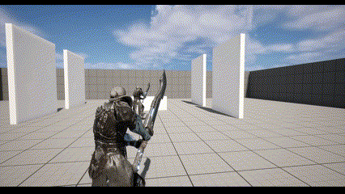
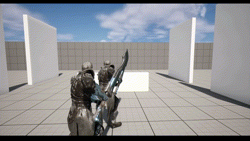

[English](#test-task-for-technical-game-designer-position-at-banzai-games)  
[Русский](#тестовое-задание-на-позицию-технического-геймдизайнера-в-студию-banzai-games)

---

# Test task for Technical Game Designer Position at Banzai Games

## Task

1. Implement a third-person character controller.
2. Integrate a game character model and its movement animation.
3. Add a second model to the scene (acting as the opponent).
4. Configure a combo attack for the player character triggered by left mouse button (LMB) clicks. A combo consists of a sequence of three attack animations (A, B, C) played consecutively in the order A -> B -> C. If the LMB is clicked during any of these animations, the sequence continues; if the animation completes without an LMB click, the combo ends, and the next LMB click starts the sequence again with attack A. 
5. Implement the launch of a hit-reaction animation (backlash) for the opponent when attacked. 
6. Optional: Place a small obstacle object behind the opponent. The opponent's backlash onto the obstacle should either destroy it (or knock it over) or simply remove it from the scene.

## Implementation

1. A Test_PlayerController class was created, containing the logic for character control.
2. The [Kwang](https://www.unrealengine.com/marketplace/en-US/product/paragon-kwang) character from the game Paragon was used as the character model.
3. An AttackAbility class was created as a inherited class to implement the character's attacks.
4. A Blueprint inherited class was derived from the AttackAbility class, implementing the logic for the combo attack.

## Result

# Тестовое задание на позицию технического геймдизайнера в студию Banzai Games

## Задание

1. Заведите контроллер персонажа от 3-го лица.
2. Встройте модель игрового персонажа и анимацию его передвижения.
3. Поставьте на сцену вторую модель (она будет оппонентом).
4. Настройте комбо-атаку для игрового персонажа на нажатие ЛКМ (комбо - это последовательность из 3х анимаций атак (А,В,С) подряд, которые запускаются по принципу А -> В -> С, если нажатие ЛКМ произошло во время одной из этих анимаций; если анимация закончилась без нажатия игроком ЛКМ, то комбо заканчивается, и следующее нажатие ЛКМ вызовет снова первую атаку А).
5. Реализуйте запуск анимации хит-реакции (отшатывания) оппонента на удары.
6. Опционально: Поставьте за спину оппонента небольшой объект-заборчик. Отшатывание оппонента на заборчик должно его разрушать (либо опрокидывать, либо просто удалять со сцены).

## Реализация

1. Создан класс контроллера Test_PlayerController, в котором реализована логика управления персонажем.
2. В качестве модели персонажа использовался персонаж [Kwang](https://www.unrealengine.com/marketplace/en-US/product/paragon-kwang) из игры Paragon.
3. Создан класс-наследник AttackAbility для реализации атаки персонажа.
4. От класса AttackAbility был создан Blueprint-наследник, где была реализована логика комбо-атаки.

## Итог

  

